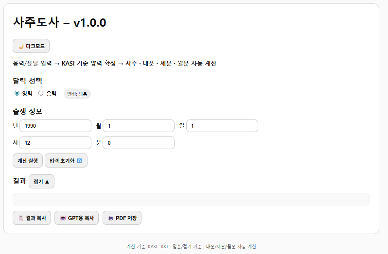
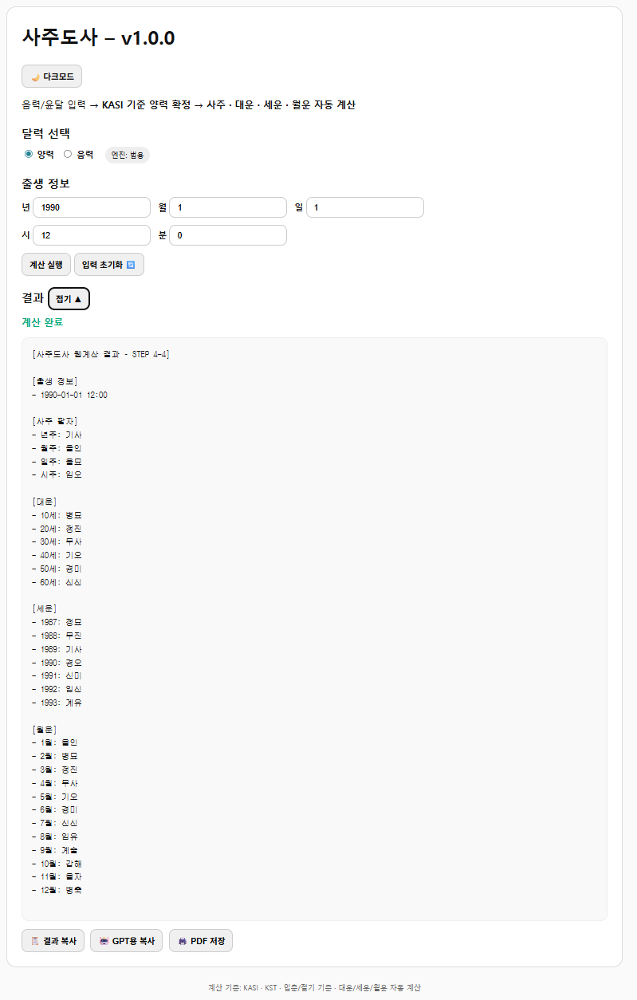

# 사주도사 (Saju Dosa) v1.0.0
무료 · 공개 사주 계산 웹도구  
(KASI 기준 · GitHub Pages 실행)

---
## 🌐 실행 페이지

👉 **GitHub Pages**
- https://sky-chronos.github.io/sajuweb-cal/

---

## 🖥️ 실행 화면

### 입력 화면

### 계산 결과 화면

---

## 📌 프로젝트 소개

**사주도사**는  
음력/윤달 입력을 포함한 출생 정보를 바탕으로  
**사주 팔자 · 대운 · 세운(연운) · 월운**을  
웹에서 **자동 계산**해주는 무료 도구입니다.

이 프로젝트는  
- 계산은 **웹에서 정확하게**
- 해석은 **GPT(사주도사 GPTs)** 에게 맡기는  
**역할 분리 구조**를 목표로 설계되었습니다.

> ❗ 본 프로젝트는 사주 *해석*이 아닌  
> **사주 계산의 안정성과 재현성**에 초점을 둡니다.

---

## ✨ 주요 기능

- ✅ 양력 / 음력 / 윤달 입력 지원
- ✅ **KASI(한국천문연구원) 기준 음력 → 양력 변환**
- ✅ 사주 팔자 (년주 · 월주 · 일주 · 시주)
- ✅ 대운 (10년 단위)
- ✅ 세운(연운)
- ✅ 월운 (12개월)
- ✅ 결과 복사 / GPT용 복사
- ✅ PDF 저장 (브라우저 인쇄)

---

## 🧮 계산 기준 (중요)

본 도구는 다음 기준을 **고정**하여 사용합니다.

- 음력 변환: **KASI (한국천문연구원)**
- 시간대: **KST (한국 표준시)**
- 연주 기준: **입춘 기준**
- 월주 기준: **절기 기준**
- 대운·세운·월운: 자동 계산

👉 계산 기준을 명확히 고정하여  
사주 계산 논쟁을 최소화합니다.

---

## 🤖 GPT 연동 사용법 (추천)

1. 웹에서 사주 계산 실행
2. **「GPT용 복사 🤖」** 버튼 클릭
3. 사주도사 GPT 또는 ChatGPT에 붙여넣기
4. 원하는 요청 입력
   - `재물운만 봐줘`
   - `애정운 위주로`
   - `직업·재물·애정 통합 리포트`

👉 계산값은 웹에서,  
👉 해석은 GPT에서 안정적으로 진행

---

## 🧩 Add-on 개념

이 프로젝트는 **확장 가능한 구조**로 설계되었습니다.

현재 제공되는 add-on 개념:
- 💎 재물운
- ❤️ 애정운
- 📊 직업·재물·애정 통합 리포트

> add-on은 **계산을 추가하지 않고**  
> 해석 레이어만 확장하는 방식입니다.

---

## 🚫 포함하지 않는 기능

이 프로젝트는 **의도적으로** 다음을 포함하지 않습니다.

- ❌ 유료 결제
- ❌ 상담 예약
- ❌ 회원제 / 로그인
- ❌ 서버 / 데이터 수집
- ❌ 사주 재계산 또는 다른 공식 혼용

---

## 🛠️ 기술 구성

- HTML / CSS / JavaScript (순수 프론트엔드)
- GitHub Pages
- `korean-lunar-calendar` (KASI 기반)

서버, DB, API 없음  
→ **완전 정적 사이트**

---

## 📂 디렉토리 구조
/
├─ index.html
├─ app.js
├─ README.md
└─ vendor/
└─ korean-lunar-calendar.min.js

---

## ⚠️ 면책 고지

본 도구는 **참고용 정보 제공**을 목적으로 합니다.  
사주 결과에 따른 선택과 판단의 책임은  
전적으로 사용자에게 있습니다.

---

## 📜 라이선스

본 프로젝트는 **개인·비상업적 사용을 허용**합니다.  
(필요 시 LICENSE 파일 추가 가능)

---

## 🙌 마무리

사주도사는  
“계산은 정확하게, 해석은 유연하게”라는 원칙 아래  
공개용 · 학습용 · 참고용 도구로 제작되었습니다.

필요한 분들께 도움이 되기를 바랍니다.

